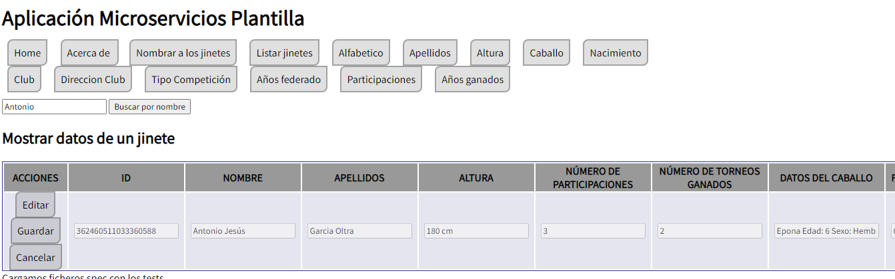

[](https://classroom.github.com/a/hneiFYl3)
[](https://classroom.github.com/online_ide?assignment_repo_id=10405481&assignment_repo_type=AssignmentRepo)
# *Plantilla Práctica Microservicios*: descripción de la aplicación

Este código que se presenta aquí corresponde a la plantilla para realizar un desarrollo basado en microservicios para las prácticas de Desarrollo Ágil, para el curso 2022-2023.


## RESOLUCIÓN DE LA PRÁCTICA

### *INFORMACIÓN SOBRE EL AUTOR*

*   *NOMBRE*: Elena 
*   *APELLIDOS*: Gómez Padilla
*   *EMAIL*: egp00044@red.ujaen.es


###  *DATOS FAUNA*

**CAPTURA de pantalla del HOME de FAUNA**


**CAPTURA de pantalla de la BASE de DATOS de FAUNA**


**CAPTURA de pantalla de la COLECCION de FAUNA**


###  DATOS EN FORMATO JSON

* **DOCUMENTO 1**
```
{
nombre_jinete: {
    nombre: "Elena",
    apellidos: "Gomez Padilla"
},
altura_jinete: 155,
datos_caballo: {
    nombre_caballo: "SalvaTierra",
    edad: 5,
    sexo: "Hembra"
},
fecha_nacimiento: {
    dia: 26,
    mes: 11,
    año: 2001
},
nombre_club_actual: "Club deportivo Hipico Alianza",
direccion_club: {
    calle: "Urb/ La Rozuela",
    numero: 11,
    localidad: "Linares",
    provincia: "Jaén",
    pais: "España"
},
tipo_competicion: "Doma clasica",
años_federado: [2014, 2015, 2016, 2018],
numero_particiapciones_torneo: 23,
numero_torneos_ganados: 15
}

```

* **DOCUMENTO 2**
```
{
  nombre_jinete: {
    nombre: "Antonio",
    apellidos: "Garcia Oltra"
  },
  altura_jinete: 169,
  datos_caballo: {
    nombre_caballo: "Epona",
    edad: 6,
    sexo: "Hembra"
  },
  fecha_nacimiento: {
    dia: 6,
    mes: 4,
    año: 2001
  },
  nombre_club_actual: "Club deportivo Hipico Alianza",
  direccion_club: {
    calle: "Urb/ La Rozuela",
    numero: 11,
    localidad: "Linares",
    provincia: "Jaén",
    pais: "España"
  },
  tipo_competicion: "Doma clasica",
  años_federado: [2019, 2021, 2022],
  numero_particiapciones_torneo: 9,
  numero_torneos_ganados: 5
}
```

* **DOCUMENTO 3**
```
{
  nombre_jinete: {
    nombre: "Juan Carlos ",
    apellidos: "Rodriguez Barrios"
  },
  altura_jinete: 192,
  datos_caballo: {
    nombre_caballo: "Angus",
    edad: 11,
    sexo: "Macho"
  },
  fecha_nacimiento: {
    dia: 12,
    mes: 8,
    año: 1999
  },
  nombre_club_actual: "Club deportivo Hipico Alianza",
  direccion_club: {
    calle: "Urb/ La Rozuela",
    numero: 11,
    localidad: "Linares",
    provincia: "Jaén",
    pais: "España"
  },
  tipo_competicion: "Doma clasica",
  años_federado: [2014, 2015, 2016, 2017],
  numero_particiapciones_torneo: 26,
  numero_torneos_ganados: 20
}
```

* **DOCUMENTO 4**
```
{
  nombre_jinete: {
    nombre: "Malena ",
    apellidos: "Bueno Pedrera"
  },
  altura_jinete: 160,
  datos_caballo: {
    nombre_caballo: "Karma",
    edad: 3,
    sexo: "Hembra"
  },
  fecha_nacimiento: {
    dia: 21,
    mes: 5,
    año: 2001
  },
  nombre_club_actual: "Club 79 Hipico",
  direccion_club: {
    calle: "UC. Eriazos de la Virgen",
    numero: 51,
    localidad: "Linares",
    provincia: "Jaén",
    pais: "España"
  },
  tipo_competicion: "Rodeo",
  años_federado: [2014, 2015],
  numero_particiapciones_torneo: 2,
  numero_torneos_ganados: 1
}
```
* **DOCUMENTO 5**
```
{
  nombre_jinete: {
    nombre: "Lucía ",
    apellidos: "Soriano Martín"
  },
  altura_jinete: 163,
  datos_caballo: {
    nombre_caballo: "Lara",
    edad: 9,
    sexo: "Hembra"
  },
  fecha_nacimiento: {
    dia: 2,
    mes: 4,
    año: 2002
  },
  nombre_club_actual: "Club 79 Hipico",
  direccion_club: {
    calle: "UC. Eriazos de la Virgen",
    numero: 51,
    localidad: "Linares",
    provincia: "Jaén",
    pais: "España"
  },
  tipo_competicion: "Rodeo",
  años_federado: [2014, 2015, 2016, 2021, 2022, 2023],
  numero_particiapciones_torneo: 32,
  numero_torneos_ganados: 26
}
```
* **DOCUMENTO 6**
```
{
  nombre_jinete: {
    nombre: "Sam ",
    apellidos: "Jimenez Maeso"
  },
  altura_jinete: 172,
  datos_caballo: {
    nombre_caballo: "Corra",
    edad: 6,
    sexo: "Hembra"
  },
  fecha_nacimiento: {
    dia: 15,
    mes: 11,
    año: 1996
  },
  nombre_club_actual: "Club Hipico Bailen",
  direccion_club: {
    calle: "Carretera de Baños",
    numero: 74,
    localidad: "Bailen",
    provincia: "Jaén",
    pais: "España"
  },
  tipo_competicion: "Doma Clasica",
  años_federado: [2023],
  numero_particiapciones_torneo: 0,
  numero_torneos_ganados: 0
}
```
* **DOCUMENTO 7**
```
{
  nombre_jinete: {
    nombre: "Juan Pablo ",
    apellidos: "Martines Morillas"
  },
  altura_jinete: 170,
  datos_caballo: {
    nombre_caballo: "Agatha",
    edad: 9,
    sexo: "Hembra"
  },
  fecha_nacimiento: {
    dia: 31,
    mes: 7,
    año: 2005
  },
  nombre_club_actual: "Club Hipico Bailen",
  direccion_club: {
    calle: "Carretera de Baños",
    numero: 74,
    localidad: "Bailen",
    provincia: "Jaén",
    pais: "España"
  },
  tipo_competicion: "Rodeo",
  años_federado: [2015, 2016, 2017, 2018, 2019, 2021, 2022, 2023],
  numero_particiapciones_torneo: 42,
  numero_torneos_ganados: 30
}
```
* **DOCUMENTO 8**
```
{
  nombre_jinete: {
    nombre: "Isabel ",
    apellidos: "Padilla Molina"
  },
  altura_jinete: 153,
  datos_caballo: {
    nombre_caballo: "Epona",
    edad: 6,
    sexo: "Hembra"
  },
  fecha_nacimiento: {
    dia: 18,
    mes: 6,
    año: 1973
  },
  nombre_club_actual: "Club deportivo Hipico Alianza",
  direccion_club: {
    calle: "Urb/ La Rozuela",
    numero: 11,
    localidad: "Linares",
    provincia: "Jaén",
    pais: "España"
  },
  tipo_competicion: "Doma clasica",
  años_federado: [2015, 2016],
  numero_particiapciones_torneo: 6,
  numero_torneos_ganados: 5
}
```
* **DOCUMENTO 9**
```
{
  nombre_jinete: {
    nombre: "Juan ",
    apellidos: "Gómez Martínez"
  },
  altura_jinete: 170,
  datos_caballo: {
    nombre_caballo: "Lara",
    edad: 9,
    sexo: "Hembra"
  },
  fecha_nacimiento: {
    dia: 6,
    mes: 12,
    año: 1972
  },
  nombre_club_actual: "Club 79 Hipico",
  direccion_club: {
    calle: "UC. Eriazos de la Virgen",
    numero: 51,
    localidad: "Linares",
    provincia: "Jaén",
    pais: "España"
  },
  tipo_competicion: "Rodeo",
  años_federado: [2021, 2022, 2023],
  numero_particiapciones_torneo: 10,
  numero_torneos_ganados: 6
}
```
* **DOCUMENTO 10**
```
{
  nombre_jinete: {
    nombre: "María",
    apellidos: "Sánchez Rodriguez"
  },
  altura_jinete: 165,
  datos_caballo: {
    nombre_caballo: "SalvaTierra",
    edad: 5,
    sexo: "Hembra"
  },
  fecha_nacimiento: {
    dia: 31,
    mes: 10,
    año: 1996
  },
  nombre_club_actual: "Club deportivo Hipico Alianza",
  direccion_club: {
    calle: "Urb/ La Rozuela",
    numero: 11,
    localidad: "Linares",
    provincia: "Jaén",
    pais: "España"
  },
  tipo_competicion: "Rodeo",
  años_federado: [2020, 2023],
  numero_particiapciones_torneo: 2,
  numero_torneos_ganados: 0
}
```

###  *TABLERO DE TRELLO*
* [Enlace al tablero de Trello](https://trello.com/b/ev2D3cAK/desarrollo-%C3%A1gil-pr3) ↗️

**TABLERO DE TRELLO EL COMIENZO DE LA ITERACIÓN 1**

Observamos que al comienzo de la iteación 1 únicamente sabriamos de la realización de dicha iteración, habiendo elegido las historias de usuario 
1, 2 y 4, con las cuales sumanos una puntuación de 0,7. 


**TABLERO DE TRELLO EL FINAL DE LA ITERACIÓN 1**

A lo largo de esta iteración las historias de usuario se han movido desde el estado "en proceso"
a hecho, más adelante añadí más fases del proyecto, tras darme cuanta se que sería muy conveniente.
La iteración finzaliza con todas las historias de usuairo seleccionadas hechas, con su respectiva documentación. 

1

**TABLERO DE TRELLO EL COMIENZO DE LA ITERACIÓN 2**

En la segunda iteración añadimos no solo dos fases más al proceso, sino también 
las historias de usuario de preparadas para la iteración 3 (azul). 
Al comienzo posicioné las historias de usuario preparadas para esta iteración (verde)
en la columna de *iteración actual*.


**TABLERO DE TRELLO EL FINAL DE LA ITERACIÓN 2**


Al finalizar la segunda iteración he realizado las historias de usuario 3, 5 y 6
añadiendo un punto de historia al total, obteniendo 1´7 puntos de historia
realizados hasta este punto.
A lo largo del proceso de realización de dichas funcionalides estan han pasado por 
varias columnas, primero *iteracion actual* que viene a ser un simil del *sprint backlog*
sin llegar a serlo ya que no usamos Scrum. Desde esa columna una a una he seleccionado la 
siguiente historia de usuario que ha pasadoa la fase *en proceso*, se mantedrá
ahí hasta que funcione correctamente, tras lo cual probaremos el TDD por lo que 
las situaré en la siguiente columna *en fase test (TDD)*. Una vez la historia
de usuario sea funcional y haya pasado los test, estará lista para el incremento. 


**TABLERO DE TRELLO EL COMIENZO DE LA ITERACIÓN 3**

En la tercera iteración seleccioné de nuevo 3 historias de usuario para llevsar a cabo su desarrollo
entre las cuales suman 1 punto de historia, resultando en un total de 2´7 puntos de historia realizados
hasta ahora.


**TABLERO DE TRELLO EL FINAL DE LA ITERACIÓN 3**


###  FUNCIONAMIENTO DE LA APLICACIÓN

###  *ITERACIÓN 1*

**HISTORIA DE USUARIO 1: AÑADIR INFORMACIÓN EN "ACERCA DE". PH:1**

En este historias de usuario su desarrollo ha sido rápido y sinmple, pues únicamente
ha sido necesario añadir mis datos a una función ya existente, resultando en un botón, que
pulsado muestra lo datos de la co-autora de la aplicación.
El método modificado ha sido: 

```
   -    acercaDe: async (req, res) => {
        try {
            CORS(res).status(200).json({
                mensaje: "Microservicio MS Plantilla: acerca de",
                autor: "Elena Gómez Padilla",
                email: "egp00044@red.ujaen.es",
                fecha: "26/11/2001"
            });
        } catch (error) {
            CORS(res).status(500).json({ error: error.description })
        }
    },
    
    -    it('Devuelve MS Plantilla Acerca De', (done) => {}

```

Un ejemplo del correcto funcionamiento del desarrollo es la siguiente captura 
de pantalla, donde se muestra que los datos mostrado por la aplicación al pulsar 
el botón *Acerca de* son correctos: 


**HISTORIA DE USUARIO 2: VER LISTADO DE LOS JINETES. PH:2**

En esta segunda historia de usuario debía obtener un listado de todos los jinetes 
de la base de datos, mostrando únicamente sus identificadores, nombres y apellidos. 
En la base de datos incluí 10 jientes, con nombres distintos pero compartiendo algunos datos,
como caballos y clubs en común. Esta información no nos será relevante por ahora, pues no
la mostraremos.
Los métodos y clases modificados/añadidos han sido: 

```
   CLASE: FRONT-END/STATIC-FILES/INDEX.HTML
    
   -    <a href="javascript:Plantilla.nombrarJinetes()" class="opcion-principal"
        title="Realizar un listado de todos los nombres de los jinetes que hay en la BBDD">Nombrar a los jinetes</a>
   
   CLASE: FRONT-END/STATIC-FILES/JS/MS-PLANTILLA.JS
   
   -    Plantilla.nombrarJinetes = function () {...}
   -    Plantilla.imprimeNombres = function (vector) {...}
   -    Plantilla.recupera = async function (callBackFn) {...}
   -    Plantilla.plantillaTablaJinetes = {...}
   -    Plantilla.plantillaTablaJinetes.cabecera
   -    Plantilla.plantillaTablaJinetes.cuerpo 
   -    Plantilla.plantillaTablaJinetes.pie = `</tbody> </table>`;
   -    Plantilla.plantillaTags = {...}
   -    Plantilla.plantillaTablaJinetes.actualizaNombres = function (jinetes) {...}
   -    Plantilla.sustituyeTags = function (plantilla, jinete) {...}
   -    Plantilla.plantillaTablaJinetes.actualizaNombres = function (jinetes) {...}

   CLASE: FRONT-END/STATIC-FILES/JS/FRONT-END.JS
   
   -    Frontend.Article.actualizar = function (titulo, contenido) {...}

   CLASE: FRONT-END/STATIC-FILES/CSS/MS-PLANTILLA.CSS
   
   -    table.listado_jinetes tbody td {...}
   -    table.listado_jinetes tbody tr {...}
   -    .form-jinete-elemento:disabled {...}
   -    .form-jinete-elemento:enabled {...}
   -    .form-jinete-elemento:enabled:required {...}
   -    table.listado_jinetes thead,table.listado_jinetes tbody, table.listado_jinetes tr, table.listado_jinetes td {...}
   -    table.listado_jinetes {...}
   
   CLASE: FRONT-END/STATIC-FILES/CSS/FRONT-END.CSS

    -   .opcion-terciaria {...}
    -   .opcion-secundaria:hover  {...}
    -   .opcion-principal {...}
    -   .opcion-terciaria {...}
    
    CLASE: FRONT-END/STATIC-FILES/JS/MS-PLANTILLA-SPEC-JC
    
    -   describe("Plantilla.imprimeNombres: ", function() {...})
   
   CLASE: MS-PLANTILLA/ROUTES.JS
   
   -    router.get("/getTodos", async (req, res) => {...}
   
   CLASE: MS-PLANTILLA/CALLBACKS.JS
   
   -    const client = new faunadb.Client({ ... });
   -    getTodos: async (req, res) => {...}
```
Un ejemplo del correcto funcionamiento del desarrollo es la siguiente captura
de pantalla, donde se muestra un listados de nos datos identificadores de cada jinete
pulsando el botón *Nombrar a los jinetes*:


**HISTORIA DE USUARIO 4: VER LISTADO DE LOS DATOS DE LOS JINETES. PH:4**

Esta es la última historia de usuario de la primera iteración, la historia de usuario
4 guarda mucha relación con la anterior, ya que en la historia de usuario 2 
se debían mostrar todos los jinetes pero únicamente por los campos identificadores (nombre y apellidos), 
en esta ocasión mostraremos todos los datos de todos los jinetes. 

```
   CLASE: FRONT-END/STATIC-FILES/INDEX.HTML
    
   -    <a href="javascript:Plantilla.listarJinetes()" class="opcion-principal"
        title="Realizar un listado de los datos de todos los jinetes que hay en la BBDD">Listar jinetes</a>
   
   CLASE: FRONT-END/STATIC-FILES/JS/MS-PLANTILLA.JS
   
   -    Plantilla.listarJinetes = function () {...}
   -    Plantilla.imprimeMuchosJinetes = function (vector) {...}
   -    Plantilla.plantillaTablaJinetes.cabeceraJinetesTodos
   -    Plantilla.plantillaTablaJinetes.cuerpoJinetesTodos 
   -    Plantilla.plantillaTablaJinetes.actualiza = function (jinete) {...}
   
    CLASE: FRONT-END/STATIC-FILES/JS/MS-PLANTILLA-SPEC-JC   
   
    -   describe("Plantilla.imprimeMuchosJinetes: ", function() {...})   
   
```

Un ejemplo del correcto funcionamiento de la historia de usuario 4 los presento en
la siguiente captura de pantalla, donde se muestra un listados de nos datos identificadores de cada jinete
pulsando el botón *Listar jinetes*:


###  *ITERACIÓN 2*

**HISTORIA DE USUARIO 3: VER UN LISTADO DE JINETES ORDENADOS ALFABÉTICAMENTE. PH:3**

La historia de usuario 3 parte de código ya desarrollado, con el añadido de un código 
específico en el método *recuperaAlfabeticamente*, en el que se ordenan los 
jinetes alfabéticamente en función del nombre. Los métodos añadidos han sido:

```
   CLASE: FRONT-END/STATIC-FILES/INDEX.HTML
    
   -   <a href="javascript:Plantilla.listarJinetesAlafetico()" class="opcion-principal"
       title="Realizar un listado en orden alfabetico de todos los jinetes (y sus datos) y  que hay en la BBDD">Alfabetico</a>
   
   CLASE: FRONT-END/STATIC-FILES/JS/MS-PLANTILLA.JS
   
   -    Plantilla.listarJinetesAlafetico = function () {...}
   -    Plantilla.recuperaAlfabeticamente = async function (callBackFn) {...}

    CLASE: FRONT-END/STATIC-FILES/JS/MS-PLANTILLA-SPEC-JC   
   
    -   describe("Plantilla.imprimeMuchosJinetes: ", function() {...})   
   
```

La función de la historia de usuario 3 es listar todos los jinetes alfabéticamente
según los nombre. De este modo, la función se lleva a cabo de pulsando 
el botón *Listar jinetes en orden alfabético* (como vemos en la imagen),
más adelante modificado a *Alfabéticamente*:

*Listado de los jinetes por orden ALFABÉTICO (nombre)*


**HISTORIA DE USUARIO 5: VER LOS DATOS DE TODOS LOS JINETES ORDENADOS 
POR EL CAMPO QUE EL USUARIO DESEE. PH:5**

La historia de usuario 5 consiste en mostrar un listado de los jinetes en función
del orden seleccionado por el usuario, por ellos hemos imcorporado un botón
por cada campo disponible. Cabe destacar que el nombre de dichos botones ha
sido modificado a posteriori, por lo que no coinciden con los mostrados en 
las imágenes. 
Los métodos añadidos o modificados han sido: 

```
   CLASE: FRONT-END/STATIC-FILES/INDEX.HTML
    
   -    <a href="javascript:Plantilla.listarPorApellido()" class="opcion-principal"
        title="Realizar un listado en orden alfabetico de los apellidos de todos los jinetes (y sus datos) y  que hay en la BBDD">Apellidos</a>
                            .
                            .
                            .
   -    <a href="javascript:Plantilla.listarPorGanados()" class="opcion-principal"
        title="Realizar un listado segun el numero de torneos ganados los jinetes (y sus datos) y  que hay en la BBDD">Años ganados</a>
   
   CLASE: FRONT-END/STATIC-FILES/JS/MS-PLANTILLA.JS
   
   -    Plantilla.imprimePorApellido = function (vector) {...}
                            .
                            .
                            .
   -    Plantilla.imprimePorGanado = function (vector) {...}

    CLASE: FRONT-END/STATIC-FILES/JS/MS-PLANTILLA-SPEC-JC   
   
    -   describe("Plantilla.imprimePorApellido: ", function() {...}) 
                            .
                            .
                            . 
    -   describe("Plantilla.imprimePorGanado: ", function() {...}) 
 
```

Las funciones realizadas por esta historia de usuario son varias, todas ellas
representadas en las siguientes imágenes

*Listado de los jinetes Ordenador por APELLIDOS*

Para listar los jinetes ordenador por apellidos, el usuario debe pulsar 
el botón *Listar jinetes por apellido* (como vemos en la imagen),
más adelante modificado a *Apellidos*:


*Listado de los jinetes Ordenador por ALTURA*

Para listar los jinetes ordenador por altura, el usuario debe pulsar
el botón *Listar jinetes por altura* (como vemos en la imagen),
más adelante modificado a *Altura*:


*Listado de los jinetes Ordenador por NOMBRE DEL CABALLO*

Para listar los jinetes ordenador por los datos del caballo, el usuario 
debe pulsar  el botón *Listar jinetes por caballo* (como vemos en la 
imagen),  más adelante modificado a *Caballo*:


*Listado de los jinetes Ordenador por AÑO DE NACIMIENTO*

Para listar los jinetes ordenador por la fecha de nacimiento, el usuario
debe pulsar  el botón *Listar jinetes por Año de nacimiento* (como vemos en la
imagen),  más adelante modificado a *Nacimiento*:


*Listado de los jinetes Ordenador por NOMBRE DEL CLUB*

Para listar los jinetes ordenador por el nombre del club, el usuario
debe pulsar  el botón *Listar jinetes por Club* (como vemos en la
imagen),  más adelante modificado a *Club*:


*Listado de los jinetes Ordenador por DIRECCION DEL CLUB*

Para listar los jinetes ordenador por la dirección del club, el usuario
debe pulsar  el botón *Listar jinetes por Dirección del Club* (como vemos en la
imagen),  más adelante modificado a *Dirección Club*:


*Listado de los jinetes Ordenador por TIPO COMPETICION*

Para listar los jinetes ordenador por el tipo de competición del jiente, el usuario
debe pulsar  el botón *Listar jinetes por Tipo Competición* (como vemos en la
imagen),  más adelante modificado a *Tipo Competición*:


*Listado de los jinetes Ordenador por AÑOS FEDERADO*

Para listar los jinetes ordenador por los años federados del jiente, el usuario
debe pulsar  el botón *Listar jinetes por Años federados* (como vemos en la
imagen),  más adelante modificado a *Años federados*:


*Listado de los jinetes Ordenador por PARTICIPACIONES*

Para listar los jinetes ordenador los años de particicipaciones del jiente ,
el usuario debe pulsar  el botón *Listar jinetes por participaciones* 
(como vemos en la  imagen),  más adelante modificado a *Participaciones*:


*Listado de los jinetes Ordenador por TORNEOS GANADOS*

Para listar los jinetes ordenador las particicipaciones ganadas del jiente ,
el usuario debe pulsar  el botón *Listar jinetes por ganados*
(como vemos en la  imagen),  más adelante modificado a *Ganados*:


**HISTORIA DE USUARIO 6: VER TODOS LOS DATOS DE UN JINETE. PH:2**

Con la realización de la historia de usuario 6 damos por finalizada la iteración 2, 
alcanzando un total de 1,7 puntos de historia, repartidos entre las 3 historias
de usuario que la conforman 
En esta ocasión el usuario podrá acceder a cada jinete por separado mediante todas las 
tablas. Para ellos hemos añadido los siguientes métodos: 

```
   CLASE: FRONT-END/STATIC-FILES/JS/MS-PLANTILLA.JS
   
   -    Plantilla.mostrar = function (idJinete) {...}
   -    Plantilla.imprimeUnJinete = function (jinete) {...}
   -    Plantilla.recuperaUnJinete = async function (idJinete, callBackFn) {...}
   -    Plantilla.plantillaFormularioJinete.actualiza = function (jinete) {...}
   -    Plantilla.jineteComoFormulario = function (jinete) {...}
   -    Plantilla.almacenaDatos = function (jinete) {...}

    CLASE: FRONT-END/STATIC-FILES/JS/MS-PLANTILLA-SPEC-JC
       
   -   describe("Plantilla.imprimeUnJinete: " , function() {...})
   
   CLASE: MS-PLANTILLA/ROUTES.JS   
   -    router.get("/getPorId/:idJinete", async (req, res) => {...}
   
   CLASE: MS-PLANTILLA/CALLBACKS.JS
   -    getPorId: async (req, res) => {...} 
```

A continuación expongo un ejemplo del correcto funcionamiento de la historia de 
usuario 6, mostrando a uno de los jinetes, para poder realizar dicha acción 
el usuario debe pulsar el botón *Mostrar* en la columna *acción* (presente 
en todas las tablas), en la fila del jinete deseado. 
Más adelante dicho botón se renombrará como *Mostrar/Editar*.

*Ejemplo de los datos de un solo jinete, esta acción se puede realiar con todos*


###  *ITERACIÓN 3*

**HISTORIA DE USUARIO 8: INCORPORAR UN BUSCADOR SEGÚN EL CRITERIO DE BÚSQUEDA DEL USUARIO. PH:5**

Tras finalizar la iteración 2 hemos obtenido 1,7 puntos de historia, añadiendo 
la siguiente funcionalidad alcanzamos los 2,2 puntos de historia. 
Esta función ha sido distinta a las anteriores ya que he tenido que realizar
un buscador que permite accerder a los jinetes de la base de datos mediante el
nombre, para que funcione correctamente deben respetarse los acentos y mayúsculas
del nombre de la base de datos. Para obtener la funcionalidad he modificado 
los siguientes métodos: 

```
   CLASE: FRONT-END/STATIC-FILES/INDEX.HTML
   
   -    <input type = "text" id="campo-busqueda">
        <button class="btn" onclick="Plantilla.comenzarBusqueda(document.getElementById('campo-busqueda').value)">Buscar por nombre</button>


   CLASE: FRONT-END/STATIC-FILES/JS/MS-PLANTILLA.JS
   
   -    Plantilla.comenzarBusqueda= function (buscado){...}
   -    Plantilla.recuperaBuscador = async function (nombreBuscado, callBackFn) {...}
```


*Buscador por nombres de los Jinetes*

Para mostrar el correcto funcionamiento de esta hisotoria de usuario he seleccionado
una única captura de pantalla, con la búsqueda de un nombre y su resultado, 
lo mismo aplica al resto de nombres del resto de los jinetes de la base de datos. 

*Ejemplo con los datos de un solo jinete, esta acción se puede realizar con todos*


**HISTORIA DE USUARIO 12: MODIFICAR EL NOMBRE DE UN JINETE. PH:2**

Este nuevo apartado supone 0.2 puntos de historia añadidos, consiste en realizar
un nuevo concepto, editar algún elemento de la base de datos, en este caso el nombre.
Lo cual se hará desde el formulario individual de cada jinete, en la sección de 
"acciones" se encuentra el botón editar, el cual activará el parámetro nombre para 
su porterior edición. Los cambios se oficializan mediante el botón Guardar, o
se desechan pulsando cancelar. 
Para obtener la funcionalidad he modificado los siguientes métodos:

```
   CLASE: MS-PLANTILLA/CALLBACKS.JS
   
   -        getTodos: async (req, res) => {...}

   CLASE: FRONT-END/STATIC-FILES/JS/MS-PLANTILLA.JS
   
   -    Plantilla.editar = function () {...}
   -    Plantilla.cancelar = function () {...}
   -    Plantilla.guardar = async function () {...}
   -    Plantilla.habilitarCampoNombre = function () {...}
   -    Plantilla.deshabilitarCampoNombre = function () {...}
    -   Plantilla.habilitarDeshabilitarCampoNombre = function (deshabilitando) {...}
    -   Plantilla.form = {...}
    -   Plantilla.opcionesMostrarOcultar = function (classname, mostrando) {...}
    -   Plantilla.recuperaDatosAlmacenados = function () {...}
    -   Plantilla.almacenaDatos = function (jinete) {...}
    -   Plantilla.ocultarOpcionesSecundarias = function () {...}
    -   Plantilla.mostrarOpcionesSecundarias = function () {...}
    -   Plantilla.mostrarOcionesTerciariasEditar = function () {...}
    -   Plantilla.ocultarOcionesTerciariasEditar = function () {...}
```

*Buscador por nombres de los Jinetes*

Observamos un ejemplo del correcto funcionamiento de la historia de usuario 
en las siguientes imagenes, vemos un ejemplo, es un jinete en concreto, 
antes y después de editarlo. 

*Ejemplo con los datos de un solo jinete, esta acción se puede realizar con todos*


**HISTORIA DE USUARIO 13: MODIFICAR MÍNIMO 3 DATOS DE UN JINETE. PH:3**

Con este funcionalidad damos por terminada la iteración 3, y con ella el proyecto. 
Sumando un total de 2,7 puntos de historia realizados. En esta ocasión hemos
añadido a los métodos existentes la funcionalidad de editar más variables
de un jinete. 
Para obtener la funcionalidad unicamente he modificado el formulario, para añadir
la posibilidad de editar a los demás atributos y los consecuentes cambios 
en métodos ya existentes 

*Buscador por nombres de los Jinetes*

Observamos un ejemplo del correcto funcionamiento de la historia de usuario
en las siguientes imagenes, vemos un ejemplo, es un jinete en concreto,
antes y después de editarlo.

*Ejemplo con los datos de un solo jinete, esta acción se puede realizar con todos*




