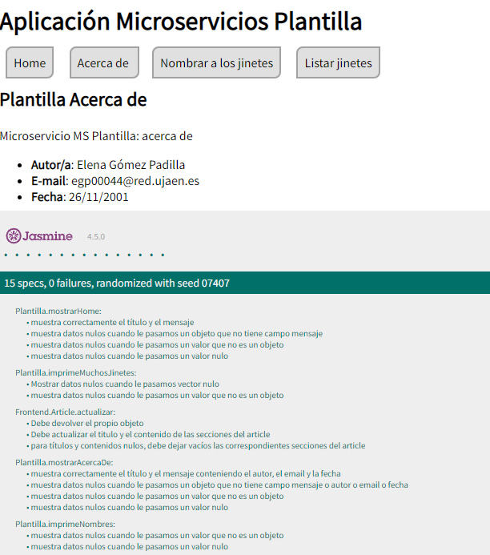

[](https://classroom.github.com/a/hneiFYl3)
[](https://classroom.github.com/online_ide?assignment_repo_id=10405481&assignment_repo_type=AssignmentRepo)
# *Plantilla Práctica Microservicios*: descripción de la aplicación

Este código que se presenta aquí corresponde a la plantilla para realizar un desarrollo basado en microservicios para las prácticas de Desarrollo Ágil, para el curso 2022-2023.


## RESOLUCIÓN DE LA PRÁCTICA

### *INFORMACIÓN SOBRE EL AUTOR*

*   *NOMBRE*: Elena 
*   *APELLIDOS*: Gómez Padilla
*   *EMAIL*: egp00044@red.ujaen.es


###  *DATOS FAUNA*

CAPTURA de pantalla del HOME de FAUNA


CAPTURA de pantalla de la BASE de DATOS de FAUNA


CAPTURA de pantalla de la COLECCION de FAUNA


###  DATOS EN FORMATO JSON

* **DOCUMENTO 1**
```
{
nombre_jinete: {
    nombre: "Elena",
    apellidos: "Gomez Padilla"
},
altura_jinete: 155,
datos_caballo: {
    nombre_caballo: "SalvaTierra",
    edad: 5,
    sexo: "Hembra"
},
fecha_nacimiento: {
    dia: 26,
    mes: 11,
    año: 2001
},
nombre_club_actual: "Club deportivo Hipico Alianza",
direccion_club: {
    calle: "Urb/ La Rozuela",
    numero: 11,
    localidad: "Linares",
    provincia: "Jaén",
    pais: "España"
},
tipo_competicion: "Doma clasica",
años_federado: [2014, 2015, 2016, 2018],
numero_particiapciones_torneo: 23,
numero_torneos_ganados: 15
}

```

* **DOCUMENTO 2**
```
{
  nombre_jinete: {
    nombre: "Antonio",
    apellidos: "Garcia Oltra"
  },
  altura_jinete: 169,
  datos_caballo: {
    nombre_caballo: "Epona",
    edad: 6,
    sexo: "Hembra"
  },
  fecha_nacimiento: {
    dia: 6,
    mes: 4,
    año: 2001
  },
  nombre_club_actual: "Club deportivo Hipico Alianza",
  direccion_club: {
    calle: "Urb/ La Rozuela",
    numero: 11,
    localidad: "Linares",
    provincia: "Jaén",
    pais: "España"
  },
  tipo_competicion: "Doma clasica",
  años_federado: [2019, 2021, 2022],
  numero_particiapciones_torneo: 9,
  numero_torneos_ganados: 5
}
```

* **DOCUMENTO 3**
```
{
  nombre_jinete: {
    nombre: "Juan Carlos ",
    apellidos: "Rodriguez Barrios"
  },
  altura_jinete: 192,
  datos_caballo: {
    nombre_caballo: "Angus",
    edad: 11,
    sexo: "Macho"
  },
  fecha_nacimiento: {
    dia: 12,
    mes: 8,
    año: 1999
  },
  nombre_club_actual: "Club deportivo Hipico Alianza",
  direccion_club: {
    calle: "Urb/ La Rozuela",
    numero: 11,
    localidad: "Linares",
    provincia: "Jaén",
    pais: "España"
  },
  tipo_competicion: "Doma clasica",
  años_federado: [2014, 2015, 2016, 2017],
  numero_particiapciones_torneo: 26,
  numero_torneos_ganados: 20
}
```

* **DOCUMENTO 4**
```
{
  nombre_jinete: {
    nombre: "Malena ",
    apellidos: "Bueno Pedrera"
  },
  altura_jinete: 160,
  datos_caballo: {
    nombre_caballo: "Karma",
    edad: 3,
    sexo: "Hembra"
  },
  fecha_nacimiento: {
    dia: 21,
    mes: 5,
    año: 2001
  },
  nombre_club_actual: "Club 79 Hipico",
  direccion_club: {
    calle: "UC. Eriazos de la Virgen",
    numero: 51,
    localidad: "Linares",
    provincia: "Jaén",
    pais: "España"
  },
  tipo_competicion: "Rodeo",
  años_federado: [2014, 2015],
  numero_particiapciones_torneo: 2,
  numero_torneos_ganados: 1
}
```
* **DOCUMENTO 5**
```
{
  nombre_jinete: {
    nombre: "Lucía ",
    apellidos: "Soriano Martín"
  },
  altura_jinete: 163,
  datos_caballo: {
    nombre_caballo: "Lara",
    edad: 9,
    sexo: "Hembra"
  },
  fecha_nacimiento: {
    dia: 2,
    mes: 4,
    año: 2002
  },
  nombre_club_actual: "Club 79 Hipico",
  direccion_club: {
    calle: "UC. Eriazos de la Virgen",
    numero: 51,
    localidad: "Linares",
    provincia: "Jaén",
    pais: "España"
  },
  tipo_competicion: "Rodeo",
  años_federado: [2014, 2015, 2016, 2021, 2022, 2023],
  numero_particiapciones_torneo: 32,
  numero_torneos_ganados: 26
}
```
* **DOCUMENTO 6**
```
{
  nombre_jinete: {
    nombre: "Sam ",
    apellidos: "Jimenez Maeso"
  },
  altura_jinete: 172,
  datos_caballo: {
    nombre_caballo: "Corra",
    edad: 6,
    sexo: "Hembra"
  },
  fecha_nacimiento: {
    dia: 15,
    mes: 11,
    año: 1996
  },
  nombre_club_actual: "Club Hipico Bailen",
  direccion_club: {
    calle: "Carretera de Baños",
    numero: 74,
    localidad: "Bailen",
    provincia: "Jaén",
    pais: "España"
  },
  tipo_competicion: "Doma Clasica",
  años_federado: [2023],
  numero_particiapciones_torneo: 0,
  numero_torneos_ganados: 0
}
```
* **DOCUMENTO 7**
```
{
  nombre_jinete: {
    nombre: "Juan Pablo ",
    apellidos: "Martines Morillas"
  },
  altura_jinete: 170,
  datos_caballo: {
    nombre_caballo: "Agatha",
    edad: 9,
    sexo: "Hembra"
  },
  fecha_nacimiento: {
    dia: 31,
    mes: 7,
    año: 2005
  },
  nombre_club_actual: "Club Hipico Bailen",
  direccion_club: {
    calle: "Carretera de Baños",
    numero: 74,
    localidad: "Bailen",
    provincia: "Jaén",
    pais: "España"
  },
  tipo_competicion: "Rodeo",
  años_federado: [2015, 2016, 2017, 2018, 2019, 2021, 2022, 2023],
  numero_particiapciones_torneo: 42,
  numero_torneos_ganados: 30
}
```
* **DOCUMENTO 8**
```
{
  nombre_jinete: {
    nombre: "Isabel ",
    apellidos: "Padilla Molina"
  },
  altura_jinete: 153,
  datos_caballo: {
    nombre_caballo: "Epona",
    edad: 6,
    sexo: "Hembra"
  },
  fecha_nacimiento: {
    dia: 18,
    mes: 6,
    año: 1973
  },
  nombre_club_actual: "Club deportivo Hipico Alianza",
  direccion_club: {
    calle: "Urb/ La Rozuela",
    numero: 11,
    localidad: "Linares",
    provincia: "Jaén",
    pais: "España"
  },
  tipo_competicion: "Doma clasica",
  años_federado: [2015, 2016],
  numero_particiapciones_torneo: 6,
  numero_torneos_ganados: 5
}
```
* **DOCUMENTO 9**
```
{
  nombre_jinete: {
    nombre: "Juan ",
    apellidos: "Gómez Martínez"
  },
  altura_jinete: 170,
  datos_caballo: {
    nombre_caballo: "Lara",
    edad: 9,
    sexo: "Hembra"
  },
  fecha_nacimiento: {
    dia: 6,
    mes: 12,
    año: 1972
  },
  nombre_club_actual: "Club 79 Hipico",
  direccion_club: {
    calle: "UC. Eriazos de la Virgen",
    numero: 51,
    localidad: "Linares",
    provincia: "Jaén",
    pais: "España"
  },
  tipo_competicion: "Rodeo",
  años_federado: [2021, 2022, 2023],
  numero_particiapciones_torneo: 10,
  numero_torneos_ganados: 6
}
```
* **DOCUMENTO 10**
```
{
  nombre_jinete: {
    nombre: "María",
    apellidos: "Sánchez Rodriguez"
  },
  altura_jinete: 165,
  datos_caballo: {
    nombre_caballo: "SalvaTierra",
    edad: 5,
    sexo: "Hembra"
  },
  fecha_nacimiento: {
    dia: 31,
    mes: 10,
    año: 1996
  },
  nombre_club_actual: "Club deportivo Hipico Alianza",
  direccion_club: {
    calle: "Urb/ La Rozuela",
    numero: 11,
    localidad: "Linares",
    provincia: "Jaén",
    pais: "España"
  },
  tipo_competicion: "Rodeo",
  años_federado: [2020, 2023],
  numero_particiapciones_torneo: 2,
  numero_torneos_ganados: 0
}
```

###  *TABLERO DE TRELLO*
* [Enlace al tablero de Trello](https://trello.com/b/ev2D3cAK/desarrollo-%C3%A1gil-pr3) ↗️

TABLERO DE TRELLO EL COMIENZO DE LA ITERACIÓN 1


TABLERO DE TRELLO EL FINAL DE LA ITERACIÓN 1


TABLERO DE TRELLO EL COMIENZO DE LA ITERACIÓN 2


TABLERO DE TRELLO EL FINAL DE LA ITERACIÓN 2


TABLERO DE TRELLO EL COMIENZO DE LA ITERACIÓN 3


TABLERO DE TRELLO EL FINAL DE LA ITERACIÓN 3


###  FUNCIONAMIENTO DE LA APLICACIÓN

###  *ITERACIÓN 1*

HISTORIA DE USUARIO 1



HISTORIA DE USUARIO 2


HISTORIA DE USUARIO 4


###  *ITERACIÓN 2*

HISTORIA DE USUARIO 3

*Listado de los Nnombres comletos de los jinetes*


HISTORIA DE USUARIO 5

*Listado de los jinetes Ordenador por APELLIDOS*


*Listado de los jinetes Ordenador por ALTURA*


*Listado de los jinetes Ordenador por NOMBRE DEL CABALLO*

*Listado de los jinetes Ordenador por AÑO DE NACIMIENTO*


*Listado de los jinetes Ordenador por NOMBRE DEL CLUB*


*Listado de los jinetes Ordenador por DIRECCION DEL CLUB*


*Listado de los jinetes Ordenador por TIPO COMPETICION*


*Listado de los jinetes Ordenador por AÑOS FEDERADO*


*Listado de los jinetes Ordenador por PARTICIPACIONES*


*Listado de los jinetes Ordenador por TORNEOS GANADOS*


HISTORIA DE USUARIO 6

*Ejemplo de los datos de un solo jinete, esta acción se puede realiar con todos*


###  *ITERACIÓN 3*

HISTORIA DE USUARIO 8

*Buscador por nombres de los Jinetes*


